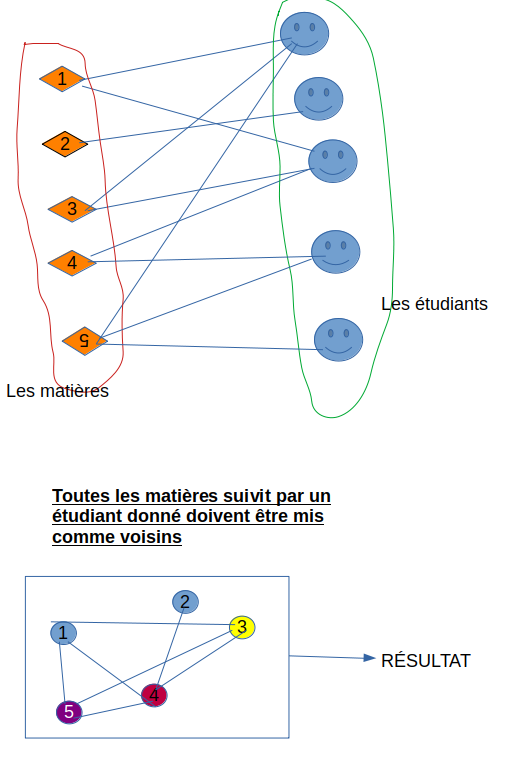

# Compte-rendu du code

## Etat du code

Tout a pu être implémenter, et nous avons pu garder aussi l'algorithme prévu lors du second rendu.

### Modélisation 

On a représenté chaque noeud d'un graphe avec pour valeur initial 0 (non Colorée).

Pour la génération du sudoku, nous avons d'abord créer les noeuds est ajouté dans le graphe. Pour les voisins il nous avons fait deux algorithmes d'abord pour que tous les noeuds appartenant à la même ligne/colonne puis un autre pour les blocs. Prenons une position (i,j), pour les lignes on prends tous ceux allant de j+1 à 9 et pour les colonnes on parcours de i+1 à 9. Pour les blocs, on peut se permettre d'ignorer les dernières lignes (ceux qui sont divisibles par 3), car les deux première lignes du bloc seront déjà voisins. Nous avons dû déterminer pour chaque cas les voisins à lier.

Pour map et gsm la génération est la même, on parcours chaque ligne puis on ajoute si l'un des mots n'est pas dans les noeuds du graphe, enfin crée l'arêtes.

## Utilisation

Ecrire ici les instructions (exactement, un copier-coller en ligne de commande doit fonctionner) pour lancer le code sur les exemples ainsi que l'interprétation des résultats, pour chacun des trois problèmes.

Avant l'éxécution il nous est demandé d'éxécuter le python avec les options -i et -o malgré des recherches sur le sujet avec le man et sur internet aucune informations nous a permis de comprendre les deux options pour cela nous avons pris avec l'imporatation de sys pour prendre les arguments par rapport à l'indice et pour garder les deux options nous avons augmenter le assert à 4 arguments et le respect des deux options.

Pour éxécuter le sudoku :

    python3 sudoku.py -i sudoku.txt -o resSudoku.txt

Pour éxécuter le gsm :

    python3 sudoku.py -i gsm.txt -o resGsm.txt

Pour éxécuter le map :

    python3 map.py -i map.txt -o resMap.txt

Pour les résultats :
Ici nous avons réussi à obtenir les résultats voulu pour chacun des problèmes. Pour la carte et antenne en prenant le premier élément cela nous a permis, de prendre le minimum de couleurs possibles.

## Extension

Un problème pourrait être une résolution d'emploi du temps d'un étudiant, on attribue les valeurs comme les horraires, l'idée est d'éviter que plusieurs cours ont la même horraire pour un étudiant.

Les noeuds représentes les différentes matières, les voisins représentes tous les cours qui sont assistés par un même groupe d'étudiant ou un seule etudiant.

voir modelisation:

Voici un exemple d'un fichier .txt:
	1---> Mathématique
	2---> Graphe
	3---> Chimie
	4---> Physique
	5---> Histoire

    Mathématique Histoire
    Physique Mathématique
    Histoire Chimie
    etc ..
    

On pourra alors attribuer des horraires qui ne rentreront pas en conflit.

NB: Les horraires ici represente les valeurs qu'on donne à chaque noeud.

