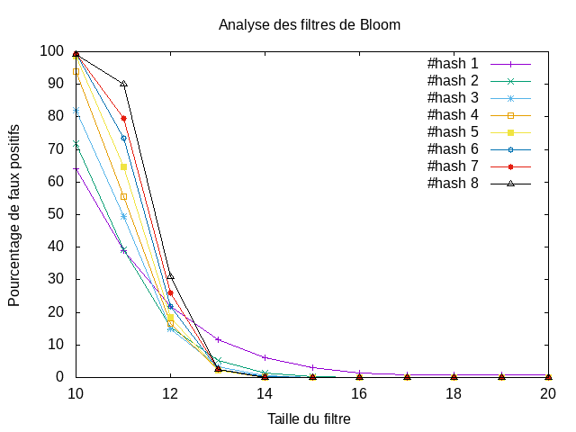

---------------
 tp-bloom
---------------

.. toctree::
   :maxdepth: 1

   hash_functions.rst
   bloomfilter.rst
   

~~~~~~~~~~
Etat du TP
~~~~~~~~~~

Décrivez ici l'état d'avancement du TP.

~~~~~~~~~~~~~~~~~~~~~~
Réponses aux questions
~~~~~~~~~~~~~~~~~~~~~~

Question 2.2.3
--------------

Dans le cas où il s'agit d'un mot de taille 2^p avec p un entier positif. Il suffit de mettre un filtre de la taille p. Ainsi dans notre exemple timoleon est de taille 8 donc quand un filtre de taille 3 on alors une liste de taille 2^3=8 et ainsi notre mot aléatoire avec une taille qui varie entre 4 et 7. On a alors la possibilité que notre mot aléatoire soit présent aussi or on ne l'avait pas ajouté dans notre filtre.

Question 4.4.3
--------------

Le graphique présent nous montre le pourcentage de faux positifs en fonction de la Taille du filtre.
Chacunes des droites dessinées corresponde à hashfunction(n) avec n allant de 1 à 8 qui correspond au nombre de hash Function. On a insérer dans notre filtre de Bloom 2^10 mots et on a comparé 2^14 mots en vérifiant qu'il ne se trouvait pas déjà dans le filtre.
On remarque alors que plus un filtre est petit plus il y a d'erreur s'il y a plus de fonctions de hashage. A l'inverse plus le filtre est grand moins le taux est grand en fonction du nombre de fonctions de hachage.
Ce qui est en soit logique car on obtient n*k indices différents dans notre filtre qui passe à True avec n le nombre de fonction de hachage et k la longueur du mot qu'on ajoute dans notre fonction. Donc il y aura plus de place prise dans le filtre si il y a plus de fonctions.

